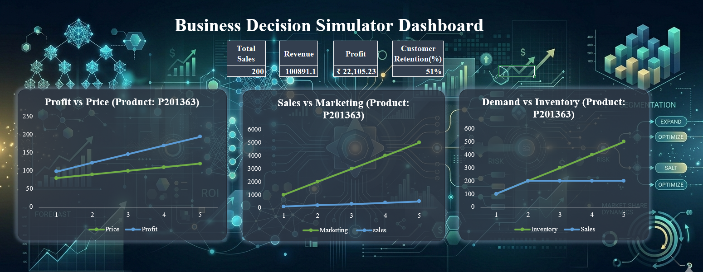

<h1 align="center"> Business Decision Simulator</h1>

  <b>End-to-End Business Analytics Project using SQL, Excel, Power BI & Tableau</b>

  Transforming raw business data into actionable insights through simulation, dashboards, and decision intelligence.

<h2> Project Overview</h2>

The <b>Business Decision Simulator</b> is a complete analytics project designed to support smarter business decisions using data.  
It combines historical analysis with scenario-based simulation focused on three major business drivers:

<ul>
  <li> Pricing Strategy</li>
  <li> Marketing Investment</li>
  <li> Inventory Planning</li>
</ul>

By adjusting these variables, users can analyze their impact on:

<ul>
  <li> Sales</li>
  <li> Revenue</li>
  <li> Profit</li>
  <li> Customer Retention</li>
</ul>

<h2> Tools & Technologies</h2>

<ul>
  <li><b>SQL</b> – Data cleaning, transformation, and simulation base creation</li>
  <li><b>Microsoft Excel</b> – Interactive business decision simulator</li>
  <li><b>Power BI</b> – Executive dashboard & business storytelling</li>
  <li><b>Tableau</b> – Comparative dashboard visualization</li>
</ul>

<h2> Data Files</h2>

<ul>
  <li><b>Original Dataset:</b> Raw business transaction data used for Power BI and Tableau dashboards.</li>
  <li><b>Simulation Base:</b> SQL-processed dataset created for the Excel simulation model.</li>
</ul>

<h2> Key Features</h2>

<ul>
  <li> Dynamic business scenario simulation</li>
  <li> KPI tracking: Sales, Revenue, Profit, Retention</li>
  <li> Trend & performance analysis</li>
  <li> Region-wise and Category-wise insights</li>
  <li> Strategic recommendations for decision-making</li>
  <li> Multi-tool dashboard development</li>
</ul>

<h2> Project Structure</h2>

<pre>
Business-Decision-Simulator/
│── Data/
│   ├── original_dataset.xlsx
│   └── simulation_base.xlsx
│
│── SQL/
│   └── simulator_base.sql
│
│── Excel/
│   └── business_decision_simulator.xlsx
│
│── PowerBI/
│   └── business_desicion_simulator_&_performance_dashboard.pbix
│
│── Tableau/
│   └── business_performance_dashboard.twbx
│
│── Screenshots/
│
│── README.md
</pre>

<h2> Dashboard Insights</h2>

<ul>
  <li> Optimal pricing significantly improves profitability</li>
  <li> Marketing boosts sales, but returns reduce after a point</li>
  <li> Inventory shortages lead to missed sales opportunities</li>
  <li> Performance varies across regions and product categories</li>
  <li>🎯 Balanced decisions create sustainable business growth</li>
</ul>

<h2> Business Value</h2>

This project demonstrates how analytics can go beyond reporting and become a powerful decision-support system.  
It helps businesses optimize strategy, improve profitability, and make proactive decisions using data.

<h2> Project Preview</h2>

<h3> Excel Simulator</h3>

  

<h3> Power BI Dashboard</h3>

  

<h3> Tableau Dashboard</h3>

  

<h2> Author</h2>

<b>Anjana C</b> 
Aspiring Business Analyst | Data Analyst | Turning Data into Decisions 🚀

⭐ If you like this project, give it a star and connect with me!

